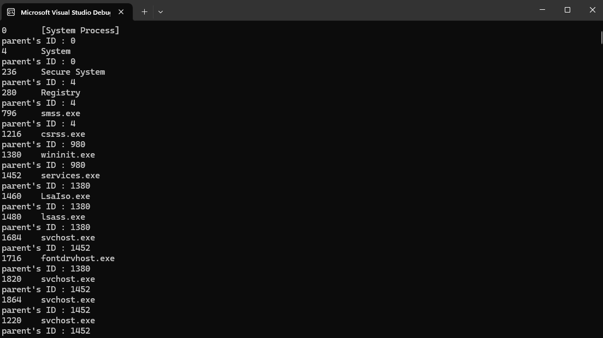

# Process Explorer

  

A cross-platform process exploration utility written in modern C++ that provides detailed system process information.

## Features

- 📊 List all running processes with PID and names
- 🔍 View process details (parent PID, executable path)
- 🛑 Terminate processes
- 🌐 Cross-platform support (Windows/Linux)
- 🖥️ Both console and GUI versions available

## Screenshots


*Windows Console Interface*


*Linux Terminal Interface*

## Installation

### Prerequisites
- C++17 compatible compiler (GCC, Clang, MSVC)
- CMake 3.10+

### Build Instructions
```bash
git clone https://github.com/yourusername/process-explorer.git
cd process-explorer
mkdir build && cd build
cmake ..
cmake --build .